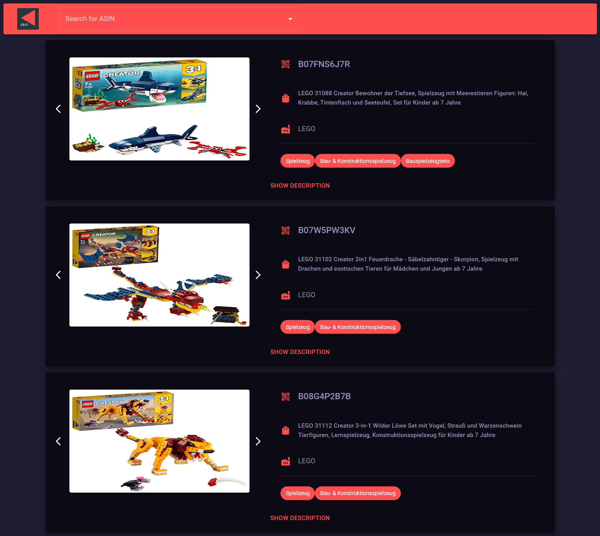

# Frontend Assignment

Implemented by [Luca Stendardo](https://www.linkedin.com/in/luca-stendardo/?locale=en_US)

## Description

Here is a somewhat different version of the task. In this version the user can browse a list of products using a dynamic search bar. The list of products can be retrieved either from a .json file locally in the repo or via an API call. The latter, however, being restricted by CORS policies can only be used in a browser window with those policies disabled. I made this choice because in the context of an exercise it allowed me to better show how I would set up the app to work in a real, protected environment.

## Tech Stack

- [React.js](https://reactjs.org/)
- [Redux Toolkit](https://redux-toolkit.js.org/)
- [Axios](https://axios-http.com/docs/intro)
- [Material UI](https://mui.com/)

## Preview

Here's a little preview

<div 
display="flex"
flex-direction="row">
    

</div>

## Run locally

### Frontend

Navigate to the client folder and run the following commands

```bash
npm install
```

In order to run the app via the API call, you need to

- go to the `App.tsx ` file
- uncomment the `<ProductView/>` component.
- open a browser window without the CORS policy restrictions.

  -To do this with Chrome in a Windows environment run the command:

  ` chrome.exe --user-data-dir="C://Chrome dev session" --disable-web-security`

  -While on Mac:

  `-open -n -a /Applications/Google\ Chrome.app/Contents/MacOS/Google\ Chrome --args --user-data-dir="/tmp/chrome_dev_test" --disable-web-security`

  ...I never tried with a Mac though :)

To use the app in local mode, meaning taking data from the .json file, just open the browser normally and leave the `<LocalProductView/>` component uncommented in the `App.tsx` file

Then just open the `client` folder and run;

```bash
npm start
```

Now it should be running on your browser!

## Contact

Luca Stendardo - [LinkedIn](https://www.linkedin.com/in/luca-stendardo/?locale=en_US) - stendardo.lu@gmail.com
